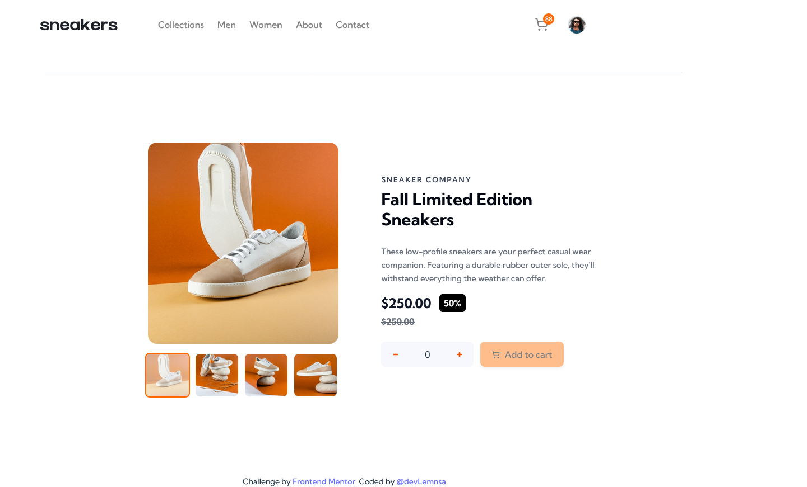

# Frontend Mentor - E-commerce product page solution

This is a solution to the [E-commerce product page challenge on Frontend Mentor](https://www.frontendmentor.io/challenges/ecommerce-product-page-UPsZ9MJp6). Frontend Mentor challenges help you improve your coding skills by building realistic projects.

## Table of contents

- [Overview](#overview)
  - [The challenge](#the-challenge)
  - [Screenshot](#screenshot)
  - [Links](#links)
- [My process](#my-process)
  - [Built with](#built-with)
  - [What I learned](#what-i-learned)
  - [Continued development](#continued-development)
- [Author](#author)
- [Acknowledgments](#acknowledgments)

## Overview

### The challenge

Users should be able to:

- View the optimal layout for the site depending on their device's screen size
- See hover states for all interactive elements on the page
- Open a lightbox gallery by clicking on the large product image
- Switch the large product image by clicking on the small thumbnail images
- Add items to the cart
- View the cart and remove items from it

### Screenshot

### Links

- Solution URL: [Solution Url](https://github.com/LemnsaLeger/Shopping-Cart-E-commerce)
- Live Site URL: [Live URL](https://shopping-cart-e-commerce-mu.vercel.app/)

## My process

### Built with

- Semantic HTML5 markup
- CSS custom properties
- Flexbox
- CSS Grid
- TailwindCSS
- Mobile-first workflow
- [React](https://reactjs.org/) - JS library
- [Vite](https://vite.dev/) - React server development Tool
- [Icons](https://https://lucide.dev/) - for icon

### What I learned
Styling with TaildwindCSS for the first time by building a Project was a challenge but i have the concepts.

React Context for making Components Props globally available through the creation of custom hooks, e.g i created useCart context for using count, items and other methods from the cart.

Use Location from react-router-dom to receive data from one component to another, like i did implement it at the level of receiving Product's data to the Product display page.

### Continued development

React Routing
React advanced Hooks.
Responsive Design (TailwindCss and CSS)

## Author

- Website - [Lemnsa Leger](https://www.your-site.com)
- Frontend Mentor - [@LemnsaLeger](https://www.frontendmentor.io/profile/LemnsaLeger)
- Frontend Mentor - [@Lemnsa](https://www.frontendmentor.io/profile/Lemnsa)
- Twitter - [@devlemnsa](https://www.twitter.com/devlemnsa)

## Acknowledgments

ShoutOut!! To FrontEnd Mentor And TheOdinProject For the challenge and the Learning resources RESPECTIVELY🙌.
